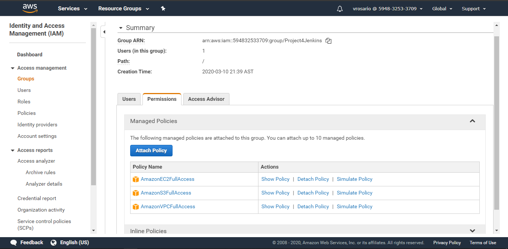
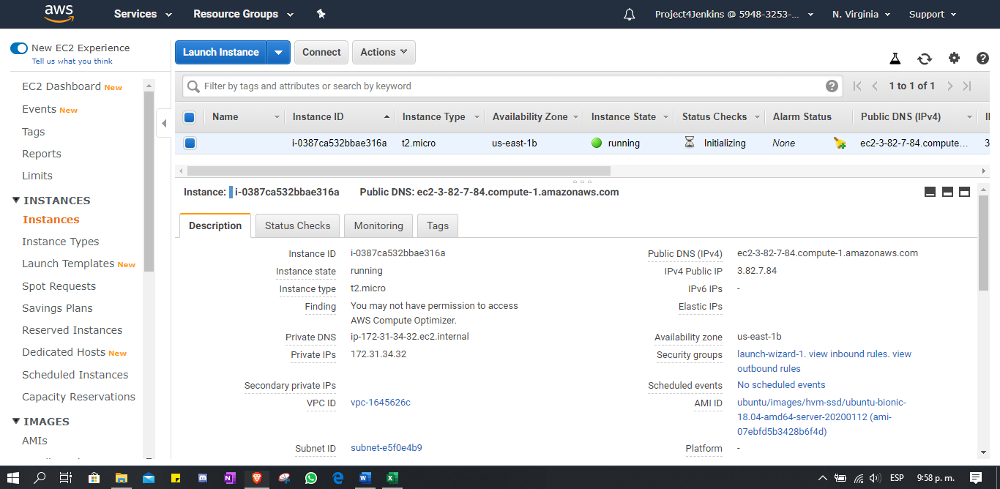
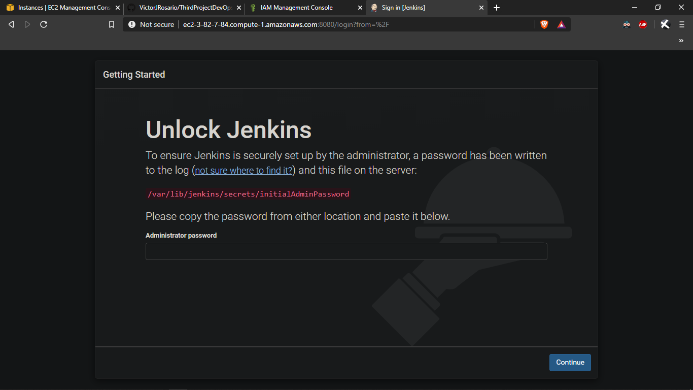
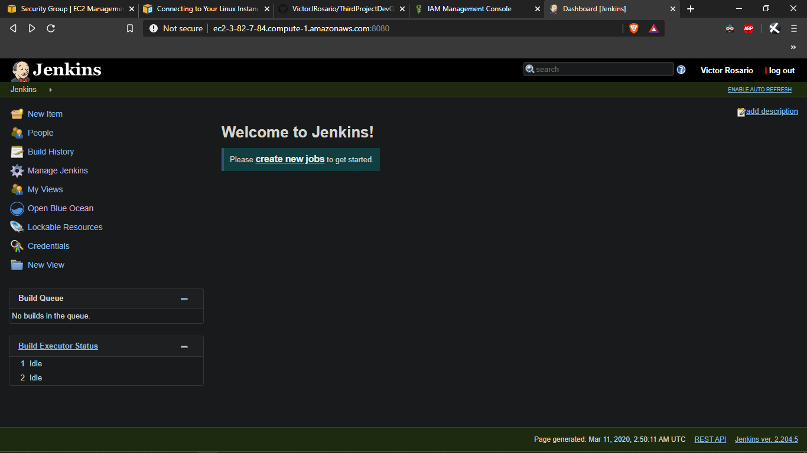
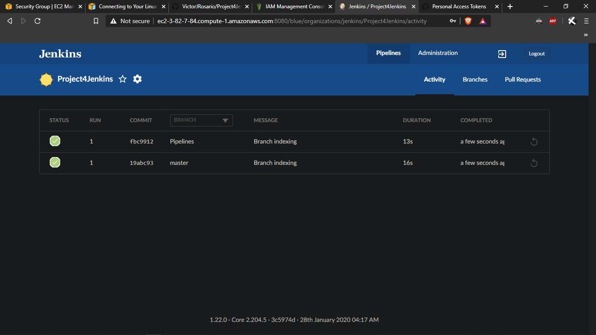
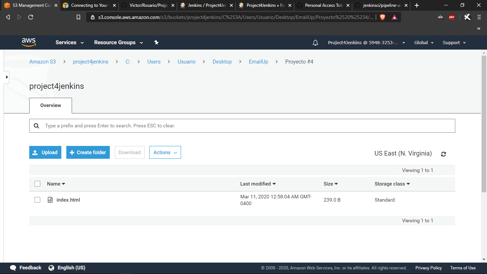
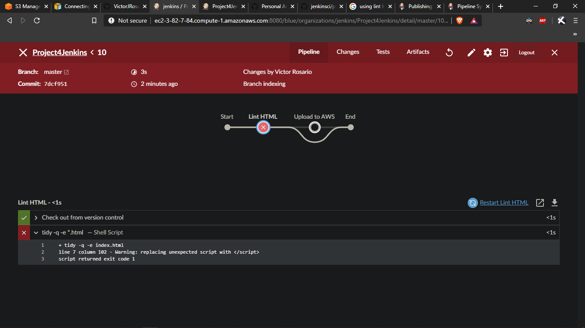
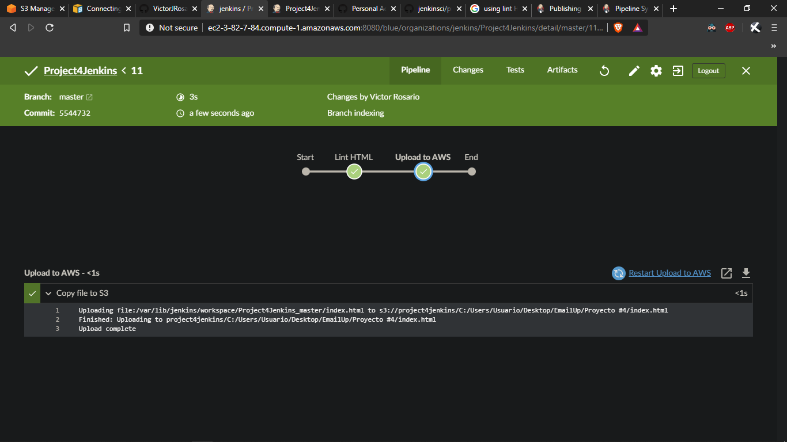

# Jenkins Pipelines on AWS

## In this project the objective was to deploy a static website on S3. Running a EC2 instance, configuring Jenkins and creating a pipeline to achieve this.

### There are 8 screenshots showing the progress of this project.

### Permissions being created.

### Unique AWS URL.

### Using FQDN, not IP.

### Showing BlueOcean link. (FQDN used)

### Showing the GitHub project as pipeline. (FQDN used)

### "index.html" rendered.

### Failure when linting.

### Deployment to S3.

